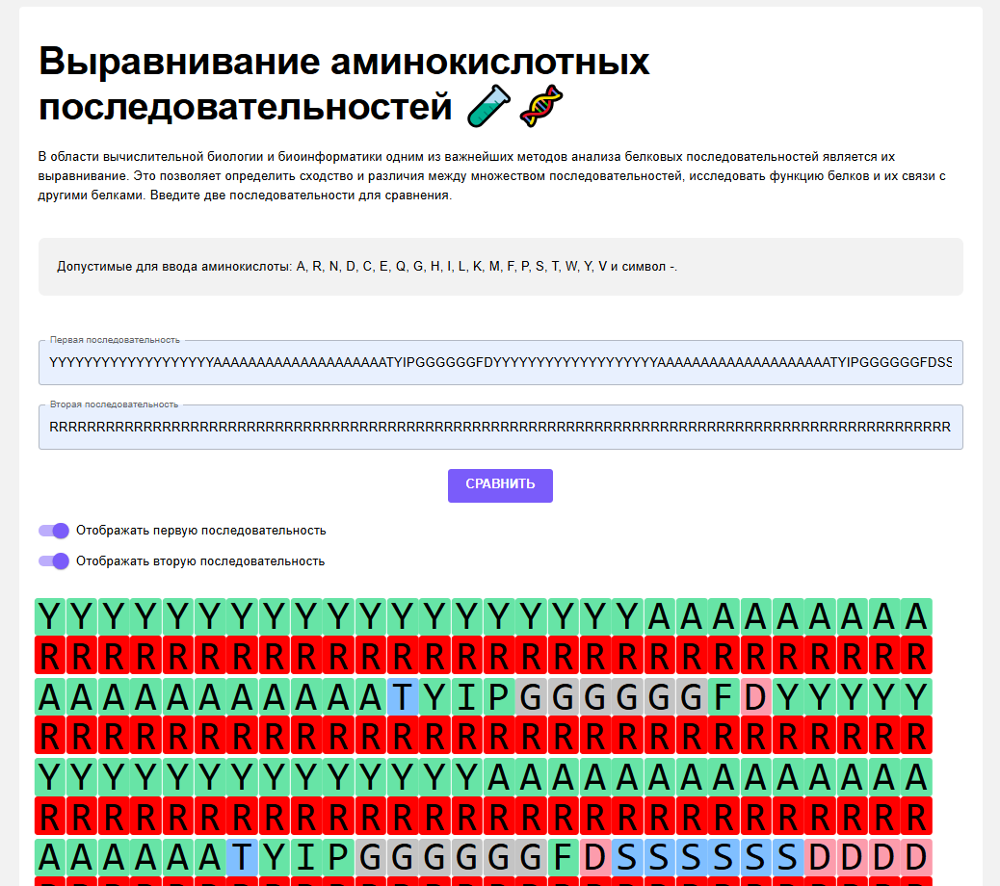

# Форма для сравнения аминокислотных последовательностей

Тестовое задание. 

## Как работает форма

1. Пользователь заполняет два инпута одинаковой длины. Отображается сравнение цепей аминокислотных последовательностей.
2. Можно применять поиск по странице. 
3. При выделении части последовательности она автоматически копируется в буфер обмена.

## Посмотреть проект

https://natgr23.github.io/AminoacidSequences/

## Стек

JS, TS, React, библиотека MUI